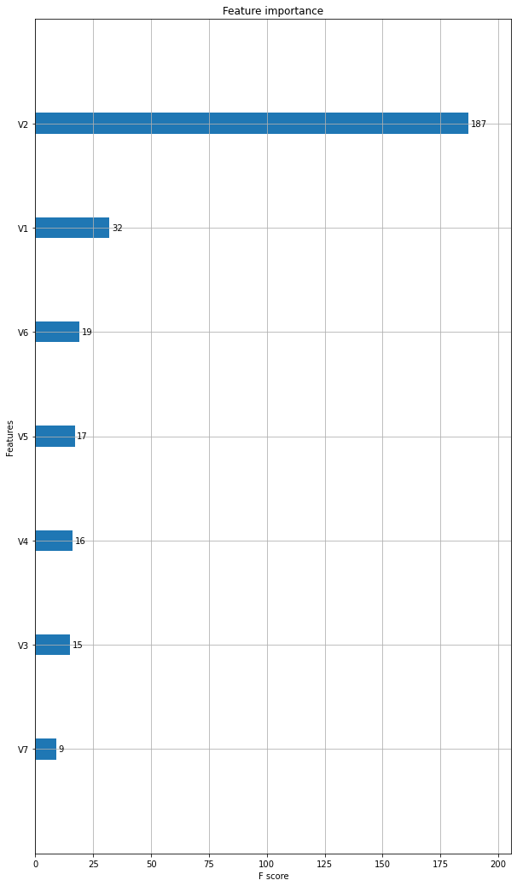

<br>


<br>
<br>
 
#### Background Information

The dataset you will be provided in this portfolio exercise was originally used as a take-home assignment provided by Starbucks for their job candidates. The data for this exercise consists of about 120,000 data points split in a 2:1 ratio among training and test files. In the experiment simulated by the data, an advertising promotion was tested to see if it would bring more customers to purchase a specific product priced at $10. Since it costs the company 0.15 to send out each promotion, it would be best to limit that promotion only to those that are most receptive to the promotion. Each data point includes one column indicating whether or not an individual was sent a promotion for the product, and one column indicating whether or not that individual eventually purchased that product. Each individual also has seven additional features associated with them, which are provided abstractly as V1-V7.

#### Optimization Strategy

Your task is to use the training data to understand what patterns in V1-V7 to indicate that a promotion should be provided to a user. Specifically, your goal is to maximize the following metrics:

* **Incremental Response Rate (IRR)** 

IRR depicts how many more customers purchased the product with the promotion, as compared to if they didn't receive the promotion. Mathematically, it's the ratio of the number of purchasers in the promotion group to the total number of customers in the purchasers group (_treatment_) minus the ratio of the number of purchasers in the non-promotional group to the total number of customers in the non-promotional group (_control_)

* **Net Incremental Revenue (NIR)**

NIR depicts how much is made (or lost) by sending out the promotion. Mathematically, this is 10 times the total number of purchasers that received the promotion minus 0.15 times the number of promotions sent out, minus 10 times the number of purchasers who were not given the promotion.

#### How To Test Your Strategy?

When you feel like you have an optimization strategy, complete the `promotion_strategy` function to pass to the `test_results` function.  
From past data, we know there are four possible outomes:

Table of actual promotion vs. predicted promotion customers:  

<table>
<tr><th></th><th colspan = '2'>Actual</th></tr>
<tr><th>Predicted</th><th>Yes</th><th>No</th></tr>
<tr><th>Yes</th><td>I</td><td>II</td></tr>
<tr><th>No</th><td>III</td><td>IV</td></tr>
</table>

The metrics are only being compared for the individuals we predict should obtain the promotion – that is, quadrants I and II.  Since the first set of individuals that receive the promotion (in the training set) receive it randomly, we can expect that quadrants I and II will have approximately equivalent participants.  

Comparing quadrant I to II then gives an idea of how well your promotion strategy will work in the future. 

Get started by reading in the data below.  See how each variable or combination of variables along with a promotion influences the chance of purchasing.  When you feel like you have a strategy for who should receive a promotion, test your strategy against the test dataset used in the final `test_results` function.


```python
# load in packages
from itertools import combinations
from test_results import  test_results, score

import numpy as np
import pandas as pd
import scipy as sp
import sklearn as sk

from sklearn.model_selection import train_test_split
from sklearn.linear_model import LogisticRegression
from sklearn.metrics import confusion_matrix, precision_score, recall_score, accuracy_score

import matplotlib.pyplot as plt
import seaborn as sb
%matplotlib inline


```

## Data Understanding

### Training data


```python
# load in the data
train_data = pd.read_csv('./training.csv')
train_data.head()
```


<div>
<style scoped>
    .dataframe tbody tr th:only-of-type {
        vertical-align: middle;
    }

    .dataframe tbody tr th {
        vertical-align: top;
    }

    .dataframe thead th {
        text-align: right;
    }
</style>
<table border="1" class="dataframe">
  <thead>
    <tr style="text-align: right;">
      <th></th>
      <th>ID</th>
      <th>Promotion</th>
      <th>purchase</th>
      <th>V1</th>
      <th>V2</th>
      <th>V3</th>
      <th>V4</th>
      <th>V5</th>
      <th>V6</th>
      <th>V7</th>
    </tr>
  </thead>
  <tbody>
    <tr>
      <th>0</th>
      <td>1</td>
      <td>No</td>
      <td>0</td>
      <td>2</td>
      <td>30.443518</td>
      <td>-1.165083</td>
      <td>1</td>
      <td>1</td>
      <td>3</td>
      <td>2</td>
    </tr>
    <tr>
      <th>1</th>
      <td>3</td>
      <td>No</td>
      <td>0</td>
      <td>3</td>
      <td>32.159350</td>
      <td>-0.645617</td>
      <td>2</td>
      <td>3</td>
      <td>2</td>
      <td>2</td>
    </tr>
    <tr>
      <th>2</th>
      <td>4</td>
      <td>No</td>
      <td>0</td>
      <td>2</td>
      <td>30.431659</td>
      <td>0.133583</td>
      <td>1</td>
      <td>1</td>
      <td>4</td>
      <td>2</td>
    </tr>
    <tr>
      <th>3</th>
      <td>5</td>
      <td>No</td>
      <td>0</td>
      <td>0</td>
      <td>26.588914</td>
      <td>-0.212728</td>
      <td>2</td>
      <td>1</td>
      <td>4</td>
      <td>2</td>
    </tr>
    <tr>
      <th>4</th>
      <td>8</td>
      <td>Yes</td>
      <td>0</td>
      <td>3</td>
      <td>28.044332</td>
      <td>-0.385883</td>
      <td>1</td>
      <td>1</td>
      <td>2</td>
      <td>2</td>
    </tr>
  </tbody>
</table>
</div>


```python
#find out the shape of the data
train_data.shape
```


    (84534, 10)


```python
#summary stats  on the data
train_data.describe()
```


<div>
<style scoped>
    .dataframe tbody tr th:only-of-type {
        vertical-align: middle;
    }

    .dataframe tbody tr th {
        vertical-align: top;
    }

    .dataframe thead th {
        text-align: right;
    }
</style>
<table border="1" class="dataframe">
  <thead>
    <tr style="text-align: right;">
      <th></th>
      <th>ID</th>
      <th>purchase</th>
      <th>V1</th>
      <th>V2</th>
      <th>V3</th>
      <th>V4</th>
      <th>V5</th>
      <th>V6</th>
      <th>V7</th>
    </tr>
  </thead>
  <tbody>
    <tr>
      <th>count</th>
      <td>84534.000000</td>
      <td>84534.000000</td>
      <td>84534.000000</td>
      <td>84534.000000</td>
      <td>84534.000000</td>
      <td>84534.000000</td>
      <td>84534.000000</td>
      <td>84534.000000</td>
      <td>84534.000000</td>
    </tr>
    <tr>
      <th>mean</th>
      <td>62970.972413</td>
      <td>0.012303</td>
      <td>1.500662</td>
      <td>29.973600</td>
      <td>0.000190</td>
      <td>1.679608</td>
      <td>2.327643</td>
      <td>2.502898</td>
      <td>1.701694</td>
    </tr>
    <tr>
      <th>std</th>
      <td>36418.440539</td>
      <td>0.110234</td>
      <td>0.868234</td>
      <td>5.010626</td>
      <td>1.000485</td>
      <td>0.466630</td>
      <td>0.841167</td>
      <td>1.117349</td>
      <td>0.457517</td>
    </tr>
    <tr>
      <th>min</th>
      <td>1.000000</td>
      <td>0.000000</td>
      <td>0.000000</td>
      <td>7.104007</td>
      <td>-1.684550</td>
      <td>1.000000</td>
      <td>1.000000</td>
      <td>1.000000</td>
      <td>1.000000</td>
    </tr>
    <tr>
      <th>25%</th>
      <td>31467.250000</td>
      <td>0.000000</td>
      <td>1.000000</td>
      <td>26.591501</td>
      <td>-0.905350</td>
      <td>1.000000</td>
      <td>2.000000</td>
      <td>2.000000</td>
      <td>1.000000</td>
    </tr>
    <tr>
      <th>50%</th>
      <td>62827.500000</td>
      <td>0.000000</td>
      <td>2.000000</td>
      <td>29.979744</td>
      <td>-0.039572</td>
      <td>2.000000</td>
      <td>2.000000</td>
      <td>3.000000</td>
      <td>2.000000</td>
    </tr>
    <tr>
      <th>75%</th>
      <td>94438.750000</td>
      <td>0.000000</td>
      <td>2.000000</td>
      <td>33.344593</td>
      <td>0.826206</td>
      <td>2.000000</td>
      <td>3.000000</td>
      <td>4.000000</td>
      <td>2.000000</td>
    </tr>
    <tr>
      <th>max</th>
      <td>126184.000000</td>
      <td>1.000000</td>
      <td>3.000000</td>
      <td>50.375913</td>
      <td>1.691984</td>
      <td>2.000000</td>
      <td>4.000000</td>
      <td>4.000000</td>
      <td>2.000000</td>
    </tr>
  </tbody>
</table>
</div>


```python
#How many promotions were Yes and How many were no
train_data['Promotion'].value_counts()
```


    Yes    42364
    No     42170
    Name: Promotion, dtype: int64


```python
# proportion of promotions given vs promotions not given in the data
train_data['Promotion'].value_counts()/train_data.shape[0]
```


    Yes    0.501147
    No     0.498853
    Name: Promotion, dtype: float64


```python
# What are the data types in our data
train_data.dtypes
```


    ID             int64
    Promotion     object
    purchase       int64
    V1             int64
    V2           float64
    V3           float64
    V4             int64
    V5             int64
    V6             int64
    V7             int64
    dtype: object


```python
# how many purchased vs how many did not purchase
train_data['purchase'].value_counts()
```


    0    83494
    1     1040
    Name: purchase, dtype: int64


```python
# proportions of those who purchased vs those who ddnt
train_data['purchase'].value_counts()/train_data.shape[0]
```


    0    0.987697
    1    0.012303
    Name: purchase, dtype: float64


```python
train_data[['Promotion','purchase']].groupby(['purchase']).count()
```


<div>
<style scoped>
    .dataframe tbody tr th:only-of-type {
        vertical-align: middle;
    }

    .dataframe tbody tr th {
        vertical-align: top;
    }

    .dataframe thead th {
        text-align: right;
    }
</style>
<table border="1" class="dataframe">
  <thead>
    <tr style="text-align: right;">
      <th></th>
      <th>Promotion</th>
    </tr>
    <tr>
      <th>purchase</th>
      <th></th>
    </tr>
  </thead>
  <tbody>
    <tr>
      <th>0</th>
      <td>83494</td>
    </tr>
    <tr>
      <th>1</th>
      <td>1040</td>
    </tr>
  </tbody>
</table>
</div>


```python
# categorise into groups of whether they got a promotion or not and purchase or not
promotion=train_data.query('Promotion == "Yes"')
no_promotion=train_data.query('Promotion=="No"')
purchase=train_data.query('purchase==1')
no_purchase=train_data.query('purchase==0')
```


```python
#group into promotion + purchase, promotion+not purchased, no promotion+purchase and no promotion+no purchase
promotion_purchase=promotion.query('purchase==1')
promotion_no_purchase=promotion.query('purchase==0')
no_promotion_purchase=no_promotion.query('purchase==1')
no_promotion_no_purchase=no_promotion.query('purchase==0')
```


```python
#Number of people who purchased through the promotion
promotion_purchase.shape[0]
```


    721


```python
#proportion of purchases through promotion to the entire population
promotion_purchase.shape[0]/train_data.shape[0]
```


    0.008529112546431022


```python
#proportion of the population that received the promotion but did not purchase
promotion_no_purchase.shape[0]/train_data.shape[0]
```


    0.4926183547448364


```python
# proportion of those who purchased with no promoion
no_promotion_purchase.shape[0]/train_data.shape[0]
```


    0.003773629545508316


```python
# proportion of those who received no promotion and did not purchase
no_promotion_no_purchase.shape[0]/train_data.shape[0]
```


    0.4950789031632243


###  Incremental Response Rate


```python
IRR=promotion_purchase.shape[0]/promotion.shape[0] - no_promotion_purchase.shape[0]/no_promotion.shape[0]
```


```python
IRR
```


    0.009454547819772702


### Net Incremental Revenue (NIR)


```python
NIR=(10*promotion_purchase.shape[0] - 0.15* promotion.shape[0])-10*no_promotion_purchase.shape[0]
```


```python
NIR
```


    -2334.5999999999995


## Data Modelling

We want to optimize the promotion strategy to people likely to purchase when promoted to so we focuss on those who
purchased from the promotion


Assign a label to those who purchased through receiving a promotion. Give them a 1. Give everyone else a 0 in the training set.


```python
# generate labels
# only those who made a purchase after receiving a promotion will be assigned a label of 1, 
# while the other individuals will be given a label of 0

response = []

for index, row in train_data.iterrows():
    if (row['purchase'] == 1) and (row['Promotion']=='Yes'):
        response.append(1.0)
    else:
        response.append(0.0)
        
train_data['response'] = response
```


```python
train_data.head()[:5]
```


<div>
<style scoped>
    .dataframe tbody tr th:only-of-type {
        vertical-align: middle;
    }

    .dataframe tbody tr th {
        vertical-align: top;
    }

    .dataframe thead th {
        text-align: right;
    }
</style>
<table border="1" class="dataframe">
  <thead>
    <tr style="text-align: right;">
      <th></th>
      <th>ID</th>
      <th>Promotion</th>
      <th>purchase</th>
      <th>V1</th>
      <th>V2</th>
      <th>V3</th>
      <th>V4</th>
      <th>V5</th>
      <th>V6</th>
      <th>V7</th>
      <th>response</th>
    </tr>
  </thead>
  <tbody>
    <tr>
      <th>0</th>
      <td>1</td>
      <td>No</td>
      <td>0</td>
      <td>2</td>
      <td>30.443518</td>
      <td>-1.165083</td>
      <td>1</td>
      <td>1</td>
      <td>3</td>
      <td>2</td>
      <td>0.0</td>
    </tr>
    <tr>
      <th>1</th>
      <td>3</td>
      <td>No</td>
      <td>0</td>
      <td>3</td>
      <td>32.159350</td>
      <td>-0.645617</td>
      <td>2</td>
      <td>3</td>
      <td>2</td>
      <td>2</td>
      <td>0.0</td>
    </tr>
    <tr>
      <th>2</th>
      <td>4</td>
      <td>No</td>
      <td>0</td>
      <td>2</td>
      <td>30.431659</td>
      <td>0.133583</td>
      <td>1</td>
      <td>1</td>
      <td>4</td>
      <td>2</td>
      <td>0.0</td>
    </tr>
    <tr>
      <th>3</th>
      <td>5</td>
      <td>No</td>
      <td>0</td>
      <td>0</td>
      <td>26.588914</td>
      <td>-0.212728</td>
      <td>2</td>
      <td>1</td>
      <td>4</td>
      <td>2</td>
      <td>0.0</td>
    </tr>
    <tr>
      <th>4</th>
      <td>8</td>
      <td>Yes</td>
      <td>0</td>
      <td>3</td>
      <td>28.044332</td>
      <td>-0.385883</td>
      <td>1</td>
      <td>1</td>
      <td>2</td>
      <td>2</td>
      <td>0.0</td>
    </tr>
  </tbody>
</table>
</div>


```python
# split data into train and valid
train, valid = sk.model_selection.train_test_split(train_data, test_size=0.2,random_state=42)
```


```python
features=['V1','V2','V3','V4','V5','V6','V7']
```


```python
# generate features and labels
Y_train = train['response']
X_train = train[features]

Y_valid = valid['response']
X_valid = valid[features]
```


```python
Y_train.value_counts()
```


    0.0    67047
    1.0      580
    Name: response, dtype: int64


```python
# check version number
import imblearn
from imblearn.over_sampling import SMOTE


```


```python
# up sample only the train dataset with SMOTE
sm = SMOTE(random_state=42, sampling_strategy = 1.0)
X_train_upsamp, Y_train_upsamp = sm.fit_resample(X_train, Y_train)
    
X_train_upsamp = pd.DataFrame(X_train_upsamp, columns=features)

Y_train_upsamp = pd.Series(Y_train_upsamp)
```

### Testing the XGBoost model on the data


```python
import xgboost as xgb
from sklearn.ensemble import GradientBoostingClassifier
from sklearn.model_selection import train_test_split

from sklearn.pipeline import Pipeline
from sklearn.preprocessing import StandardScaler
from sklearn.decomposition import PCA
from xgboost.sklearn import XGBClassifier
from sklearn.model_selection import RandomizedSearchCV, GridSearchCV
```


```python
model = xgb.XGBClassifier(learning_rate = 1 , max_depth = 7,
                          min_child_weight = 5,
                          objective = 'binary:logistic',
                          seed = 42,
                          gamma = 0.1,
                          n_estimators = 15,
                          colsample_bytree = 0.3,
                          alpha = 10,
                          silent = True)
model.fit(X_train_upsamp, Y_train_upsamp,eval_metric="auc")


print("Accuracy score (training): {0:.3f}".format(model.score(X_train, Y_train)))
print("Accuracy score (validation): {0:.3f}".format(model.score(X_valid, Y_valid)))
```

    [17:43:41] WARNING: /tmp/build/80754af9/xgboost-split_1619724447847/work/src/learner.cc:541: 
    Parameters: { silent } might not be used.
    
      This may not be accurate due to some parameters are only used in language bindings but
      passed down to XGBoost core.  Or some parameters are not used but slip through this
      verification. Please open an issue if you find above cases.
    
    
    Accuracy score (training): 0.716
    Accuracy score (validation): 0.712


```python
# check which features are important

from xgboost import plot_importance
from matplotlib import pyplot

fig, ax = pyplot.subplots(figsize=(10, 18));
xgb.plot_importance(model, ax=ax);
```


    

    


```python
# confusion matrix
valid_pred = model.predict(X_valid)
cm = sk.metrics.confusion_matrix
cm(Y_valid, valid_pred)
```


    array([[11979,  4787],
           [   89,    52]])


```python
# confusion marix for the validation set
valid_pred = model.predict(X_valid)
cm = sk.metrics.confusion_matrix(Y_valid, valid_pred)

fig, ax= plt.subplots(figsize=(10,10))
sb.heatmap(cm, annot=True, fmt='g', ax = ax); #annot=True to annotate cells

# labels, title and ticks
ax.set_xlabel('Predicted labels');
ax.set_ylabel('True labels'); 
ax.set_title('Confusion Matrix'); 
ax.xaxis.set_ticklabels(['No Purchase', 'Made Purchase']); 
ax.yaxis.set_ticklabels(['No Purchase', 'Made Purchase']);
```


    

    


```python
# calculate the accuracy
accuracy_score(Y_valid, valid_pred)
```


    0.7115987460815048


```python
#transform 0/1 array in prediction to Yes/No array
my_map = {0: "No", 1: "Yes"}
promotion = np.vectorize(my_map.get)(valid_pred)
```


```python
promotion
```


    array(['No', 'No', 'No', ..., 'Yes', 'Yes', 'Yes'], dtype='<U3')


```python
#This dataframe is useful as a unit test to compare star bucks values with the ones we obtained in this model
def promotion_strategy(df):
    '''
    INPUT 
    df - a dataframe with *only* the columns V1 - V7 (same as train_data)

    OUTPUT
    promotion_df - np.array with the values
                   'Yes' or 'No' related to whether or not an 
                   individual should recieve a promotion 
                   should be the length of df.shape[0]
                
    Ex:
    INPUT: df
    
    V1	V2	  V3	V4	V5	V6	V7
    2	30	-1.1	1	1	3	2
    3	32	-0.6	2	3	2	2
    2	30	0.13	1	1	4	2
    
    OUTPUT: promotion
    
    array(['Yes', 'Yes', 'No'])
    indicating the first two users would recieve the promotion and 
    the last should not.
    '''
    test = df
    
    preds = model.predict(test)

    promotion = []
    for pred in preds:
        if pred == 1:
            promotion.append('Yes')
        else:
            promotion.append('No')
    promotion = np.array(promotion)
    return promotion
```


```python
# Use the test data on our model
test_data = pd.read_csv('./Test.csv')
df = test_data[['V1', 'V2', 'V3', 'V4', 'V5', 'V6', 'V7']]
```


```python
#pass the test dataframe to our model in the promotion strategy dataframe
promotion_strategy(df)
```


    array(['No', 'No', 'Yes', ..., 'No', 'No', 'No'], dtype='<U3')


```python
# Test results against those obtained by star bucks model
test_results(promotion_strategy)
```

    Our irr with this strategy is 0.0175.
    
    Our nir with this strategy is 142.30.
    Starbucks came up with a model with an irr of 0.0188 and an nir of 189.45 on the test set.
    
     How did you do?


    (0.017548872164419627, 142.30000000000007)


```python
test_ = pd.read_csv('./Test.csv')
df1 = test_[['V1', 'V2', 'V3', 'V4', 'V5', 'V6', 'V7']]
predictions = model.predict(df1)
```


```python
promotion = []
    
for pred in predictions:
    if pred == 1:
        promotion.append('Yes')
    else:
        promotion.append('No')
promotion = np.array(promotion)
```


```python
test_['Promotion_Strategy'] = promotion.tolist()
```


```python
test_
```


<div>
<style scoped>
    .dataframe tbody tr th:only-of-type {
        vertical-align: middle;
    }

    .dataframe tbody tr th {
        vertical-align: top;
    }

    .dataframe thead th {
        text-align: right;
    }
</style>
<table border="1" class="dataframe">
  <thead>
    <tr style="text-align: right;">
      <th></th>
      <th>ID</th>
      <th>Promotion</th>
      <th>purchase</th>
      <th>V1</th>
      <th>V2</th>
      <th>V3</th>
      <th>V4</th>
      <th>V5</th>
      <th>V6</th>
      <th>V7</th>
      <th>Promotion_Strategy</th>
    </tr>
  </thead>
  <tbody>
    <tr>
      <th>0</th>
      <td>2</td>
      <td>No</td>
      <td>0</td>
      <td>1</td>
      <td>41.376390</td>
      <td>1.172517</td>
      <td>1</td>
      <td>1</td>
      <td>2</td>
      <td>2</td>
      <td>No</td>
    </tr>
    <tr>
      <th>1</th>
      <td>6</td>
      <td>Yes</td>
      <td>0</td>
      <td>1</td>
      <td>25.163598</td>
      <td>0.653050</td>
      <td>2</td>
      <td>2</td>
      <td>2</td>
      <td>2</td>
      <td>No</td>
    </tr>
    <tr>
      <th>2</th>
      <td>7</td>
      <td>Yes</td>
      <td>0</td>
      <td>1</td>
      <td>26.553778</td>
      <td>-1.597972</td>
      <td>2</td>
      <td>3</td>
      <td>4</td>
      <td>2</td>
      <td>Yes</td>
    </tr>
    <tr>
      <th>3</th>
      <td>10</td>
      <td>No</td>
      <td>0</td>
      <td>2</td>
      <td>28.529691</td>
      <td>-1.078506</td>
      <td>2</td>
      <td>3</td>
      <td>2</td>
      <td>2</td>
      <td>No</td>
    </tr>
    <tr>
      <th>4</th>
      <td>12</td>
      <td>No</td>
      <td>0</td>
      <td>2</td>
      <td>32.378538</td>
      <td>0.479895</td>
      <td>2</td>
      <td>2</td>
      <td>1</td>
      <td>2</td>
      <td>No</td>
    </tr>
    <tr>
      <th>...</th>
      <td>...</td>
      <td>...</td>
      <td>...</td>
      <td>...</td>
      <td>...</td>
      <td>...</td>
      <td>...</td>
      <td>...</td>
      <td>...</td>
      <td>...</td>
      <td>...</td>
    </tr>
    <tr>
      <th>41645</th>
      <td>126166</td>
      <td>No</td>
      <td>0</td>
      <td>1</td>
      <td>33.073275</td>
      <td>-0.126150</td>
      <td>2</td>
      <td>2</td>
      <td>2</td>
      <td>2</td>
      <td>Yes</td>
    </tr>
    <tr>
      <th>41646</th>
      <td>126174</td>
      <td>Yes</td>
      <td>0</td>
      <td>0</td>
      <td>32.065720</td>
      <td>0.999361</td>
      <td>2</td>
      <td>3</td>
      <td>2</td>
      <td>1</td>
      <td>Yes</td>
    </tr>
    <tr>
      <th>41647</th>
      <td>126176</td>
      <td>Yes</td>
      <td>1</td>
      <td>3</td>
      <td>27.691221</td>
      <td>1.172517</td>
      <td>2</td>
      <td>2</td>
      <td>1</td>
      <td>2</td>
      <td>No</td>
    </tr>
    <tr>
      <th>41648</th>
      <td>126177</td>
      <td>Yes</td>
      <td>0</td>
      <td>2</td>
      <td>32.306427</td>
      <td>0.566472</td>
      <td>1</td>
      <td>2</td>
      <td>4</td>
      <td>1</td>
      <td>No</td>
    </tr>
    <tr>
      <th>41649</th>
      <td>126178</td>
      <td>Yes</td>
      <td>0</td>
      <td>1</td>
      <td>30.540005</td>
      <td>1.691984</td>
      <td>1</td>
      <td>3</td>
      <td>1</td>
      <td>2</td>
      <td>No</td>
    </tr>
  </tbody>
</table>
<p>41650 rows × 11 columns</p>
</div>


```python
test_.shape
```


    (41650, 11)


```python
# Accoding to our model, which are the best customers to target that maximizes the Incremental
#Response Rate and Net Incremental Revenue? 
test_[(test_['Promotion']=='Yes') & (test_['purchase']==1) & (test_['Promotion_Strategy']=='Yes')]
```


<div>
<style scoped>
    .dataframe tbody tr th:only-of-type {
        vertical-align: middle;
    }

    .dataframe tbody tr th {
        vertical-align: top;
    }

    .dataframe thead th {
        text-align: right;
    }
</style>
<table border="1" class="dataframe">
  <thead>
    <tr style="text-align: right;">
      <th></th>
      <th>ID</th>
      <th>Promotion</th>
      <th>purchase</th>
      <th>V1</th>
      <th>V2</th>
      <th>V3</th>
      <th>V4</th>
      <th>V5</th>
      <th>V6</th>
      <th>V7</th>
      <th>Promotion_Strategy</th>
    </tr>
  </thead>
  <tbody>
    <tr>
      <th>457</th>
      <td>1411</td>
      <td>Yes</td>
      <td>1</td>
      <td>0</td>
      <td>19.164378</td>
      <td>-0.299306</td>
      <td>2</td>
      <td>1</td>
      <td>3</td>
      <td>2</td>
      <td>Yes</td>
    </tr>
    <tr>
      <th>922</th>
      <td>2816</td>
      <td>Yes</td>
      <td>1</td>
      <td>0</td>
      <td>27.993200</td>
      <td>-0.732194</td>
      <td>2</td>
      <td>1</td>
      <td>2</td>
      <td>2</td>
      <td>Yes</td>
    </tr>
    <tr>
      <th>1002</th>
      <td>3121</td>
      <td>Yes</td>
      <td>1</td>
      <td>1</td>
      <td>27.647377</td>
      <td>-0.818772</td>
      <td>2</td>
      <td>1</td>
      <td>2</td>
      <td>2</td>
      <td>Yes</td>
    </tr>
    <tr>
      <th>1015</th>
      <td>3153</td>
      <td>Yes</td>
      <td>1</td>
      <td>2</td>
      <td>25.188348</td>
      <td>1.518828</td>
      <td>2</td>
      <td>1</td>
      <td>1</td>
      <td>2</td>
      <td>Yes</td>
    </tr>
    <tr>
      <th>1131</th>
      <td>3496</td>
      <td>Yes</td>
      <td>1</td>
      <td>1</td>
      <td>32.844176</td>
      <td>-0.212728</td>
      <td>2</td>
      <td>3</td>
      <td>4</td>
      <td>1</td>
      <td>Yes</td>
    </tr>
    <tr>
      <th>...</th>
      <td>...</td>
      <td>...</td>
      <td>...</td>
      <td>...</td>
      <td>...</td>
      <td>...</td>
      <td>...</td>
      <td>...</td>
      <td>...</td>
      <td>...</td>
      <td>...</td>
    </tr>
    <tr>
      <th>40044</th>
      <td>121386</td>
      <td>Yes</td>
      <td>1</td>
      <td>1</td>
      <td>30.353005</td>
      <td>-0.991928</td>
      <td>2</td>
      <td>3</td>
      <td>1</td>
      <td>2</td>
      <td>Yes</td>
    </tr>
    <tr>
      <th>40642</th>
      <td>123166</td>
      <td>Yes</td>
      <td>1</td>
      <td>1</td>
      <td>27.259451</td>
      <td>-0.732194</td>
      <td>2</td>
      <td>3</td>
      <td>1</td>
      <td>2</td>
      <td>Yes</td>
    </tr>
    <tr>
      <th>40890</th>
      <td>123945</td>
      <td>Yes</td>
      <td>1</td>
      <td>1</td>
      <td>27.404750</td>
      <td>-0.385883</td>
      <td>1</td>
      <td>3</td>
      <td>1</td>
      <td>2</td>
      <td>Yes</td>
    </tr>
    <tr>
      <th>41311</th>
      <td>125171</td>
      <td>Yes</td>
      <td>1</td>
      <td>1</td>
      <td>26.863457</td>
      <td>-1.251661</td>
      <td>2</td>
      <td>3</td>
      <td>2</td>
      <td>2</td>
      <td>Yes</td>
    </tr>
    <tr>
      <th>41483</th>
      <td>125737</td>
      <td>Yes</td>
      <td>1</td>
      <td>1</td>
      <td>27.611350</td>
      <td>-1.251661</td>
      <td>2</td>
      <td>1</td>
      <td>1</td>
      <td>2</td>
      <td>Yes</td>
    </tr>
  </tbody>
</table>
<p>152 rows × 11 columns</p>
</div>


```python
best_customers=test_[(test_['Promotion']=='Yes') & (test_['purchase']==1) & (test_['Promotion_Strategy']=='Yes')]
```


```python
best_customers=best_customers.drop(['Promotion','purchase','V1','V2','V3','V4','V5','V6','V7','Promotion_Strategy'], axis=1)
```


```python
best_customers.to_csv('Best_Customers_Target.csv')
```


```python

```
